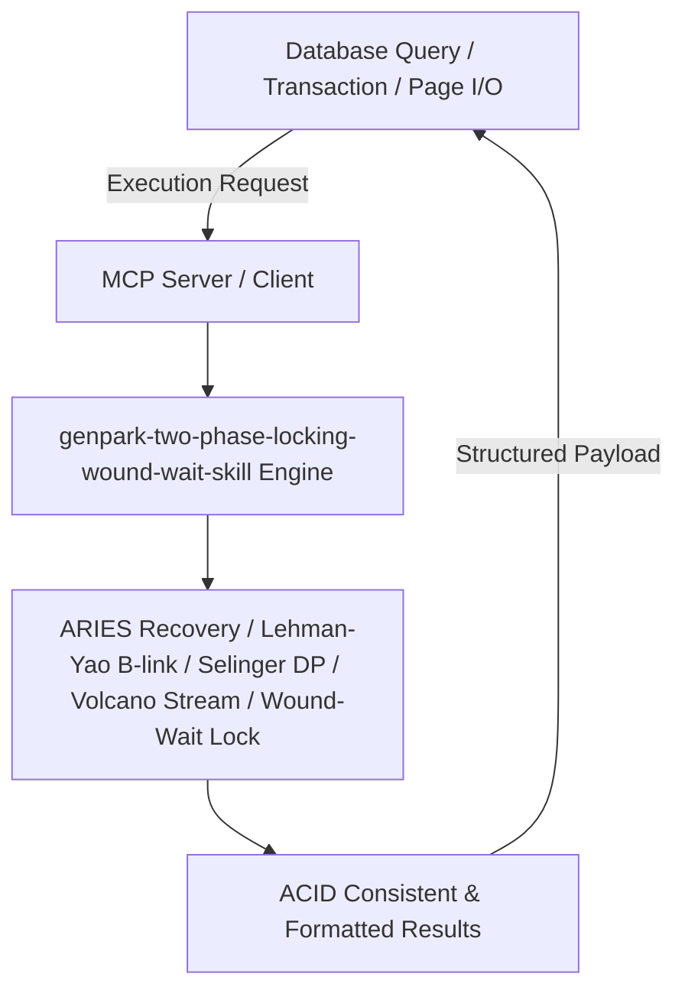

# genpark-two-phase-locking-wound-wait-skill

[](https://github.com/alphaparkinc/genpark-two-phase-locking-wound-wait-skill)
[](https://python.org)
[](#)
[](#)
[](LICENSE)

> Strict Two-Phase Locking (SS2PL) concurrency control with Wound-Wait timestamp-based deadlock prevention algorithm.

## Architecture Overview



## Features
- **0 External Pip Dependencies**: Pure Python standard library implementation.
- **MCP Protocol Ready**: Includes Model Context Protocol server script (`mcp_server.py`).
- **Production Standard**: Fully verified ACID durability, concurrency safety, and iterator pipeline throughput.

## Quick Start
```bash
python example_usage.py
```
